<div align="center">

# 🚗 CarField

### A Premium Full-Stack Car Showroom & E-Commerce Platform

Browse, filter, wishlist, and purchase cars in a sleek, dark-themed showroom experience — built end-to-end with the MERN stack.

[](https://carfield.vercel.app)
[](https://github.com/Vishnukumar17072007/car-showroom-project)
[](./LICENSE)


[🔗 Live Demo](https://carfield.vercel.app) · [📂 Repository](https://github.com/Vishnukumar17072007/car-showroom-project) · [🐞 Report a Bug](https://github.com/Vishnukumar17072007/car-showroom-project/issues)

</div>

---

## 📖 About the Project

**CarField** is a full-stack car showroom and e-commerce web application where users can explore a curated catalog of vehicles, filter by price/body type/transmission/fuel, manage a wishlist and cart, place orders, and track them in real time. Admins get a dedicated dashboard to manage inventory, monitor revenue, and oversee orders — all backed by a real-time notification system built with Socket.IO.

This project was built as a hands-on learning journey through the MERN stack — covering authentication, real-time systems, cloud deployment, and solving real production-style problems like cross-domain cookie authentication.

---

## ✨ Features

### 🛍️ For Users
- Browse a full car catalog with **server-side filtering** (price, body type, transmission, fuel type) and **search**
- **Wishlist** and **Cart** with persistent state
- Secure **JWT-based authentication** with **Google OAuth (Sign in with Google)**
- Seamless **checkout flow** with shipping details form and order confirmation
- **Order tracking** — Pending → Approved → Delivered / Cancelled, with full order history
- Personalized **User Dashboard** with spending analytics, order status breakdown, and history
- **Real-time notifications** (order updates, etc.) powered by Socket.IO
- Editable **profile** with photo upload (via Cloudinary), password change, and address management
- **Light / Dark mode** toggle with persistent theme selection
- In-app **Support Chat** assistant

### 🛠️ For Admins
- **Admin Dashboard** with live stats — total users, active cars, total orders, total revenue
- **Monthly revenue & order trends**, order status distribution, and inventory breakdown by body type
- Full **CRUD on vehicle listings** (add, edit, delete cars) directly from the catalog view
- **Order management** — approve, reject, or update order/delivery status
- Unified **role-based dashboard** — single codebase renders admin or user views based on role

---

## 🖥️ Screenshots

> All screenshots below are from the live application. Light and dark mode are both fully supported.

### 🏠 Homepage & Authentication

| Homepage | Sign In | Create Account |
|---|---|---|
| 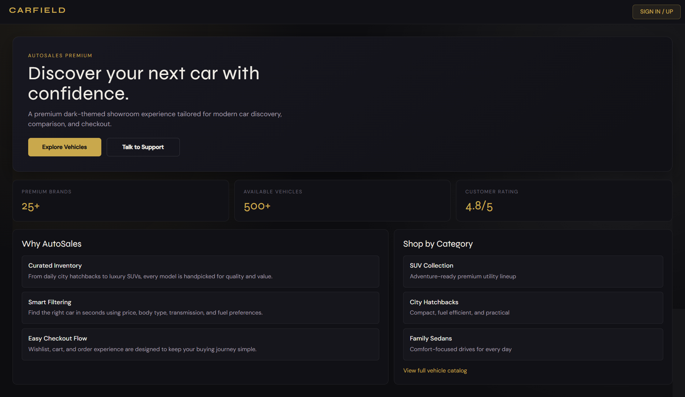 | 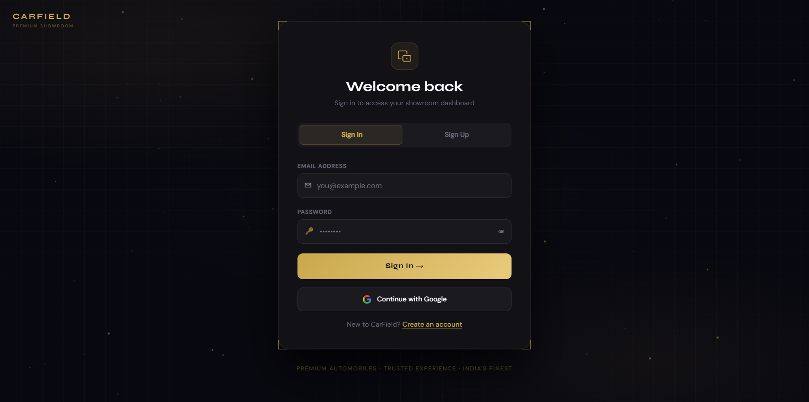 | 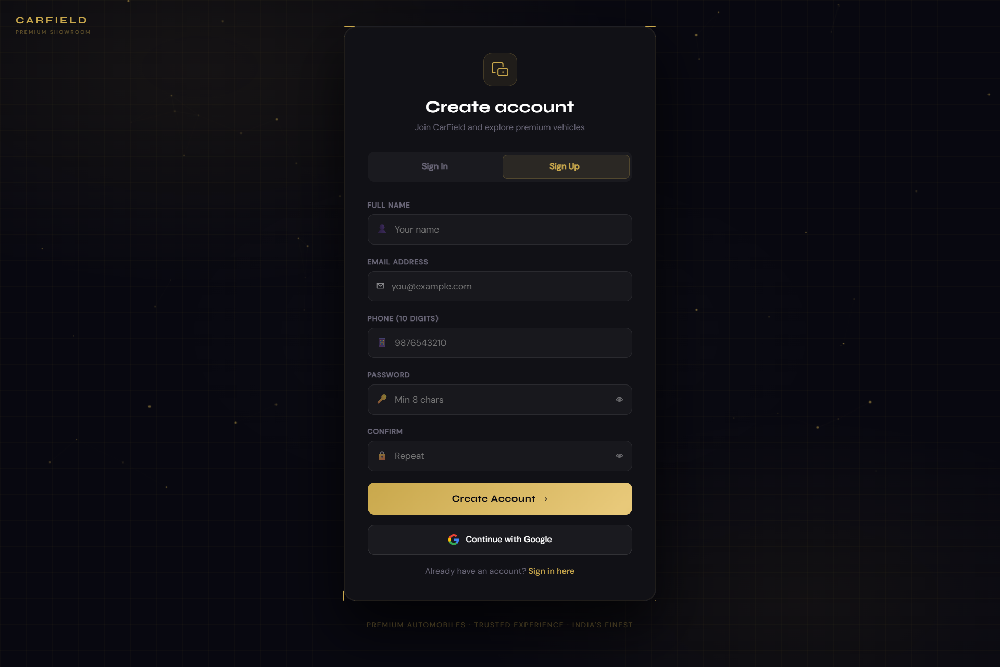 |

### 🚘 Vehicle Catalog

| Vehicle Listing (User) | Vehicle Management (Admin — Light Mode) |
|---|---|
| 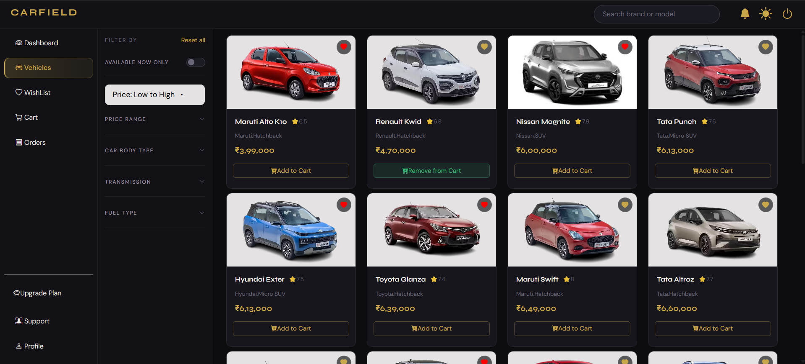 | .png) |

### 🛒 Cart, Wishlist & Checkout

| Wishlist | Cart | Shipping / Checkout |
|---|---|---|
| 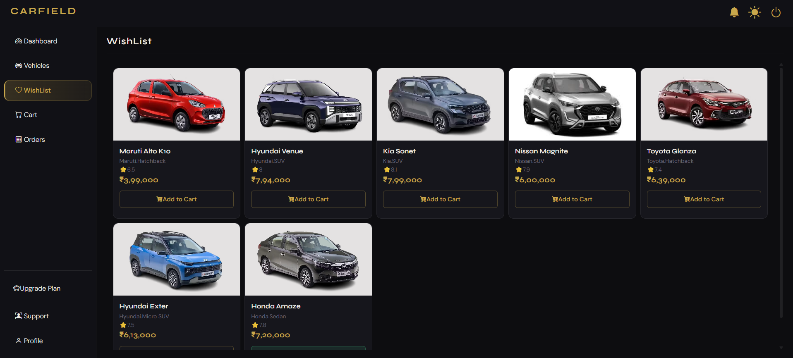 | 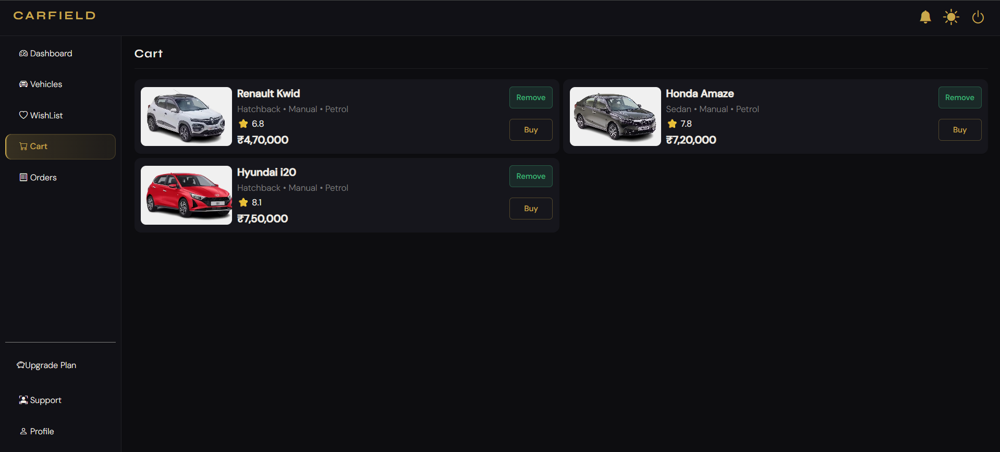 | 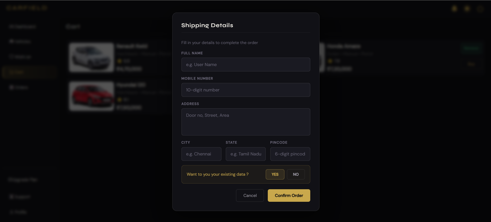 |

### 📦 Orders

| My Orders (User) | Orders (Admin View) |
|---|---|
| 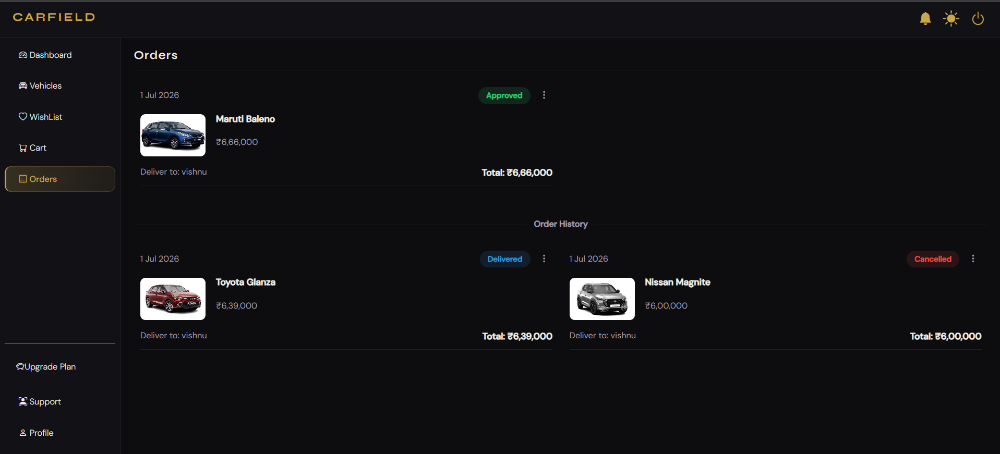 | .png) |

### 📊 Dashboards

| User Dashboard | Admin Dashboard (Dark) | Admin Dashboard (Light Mode) |
|---|---|---|
| 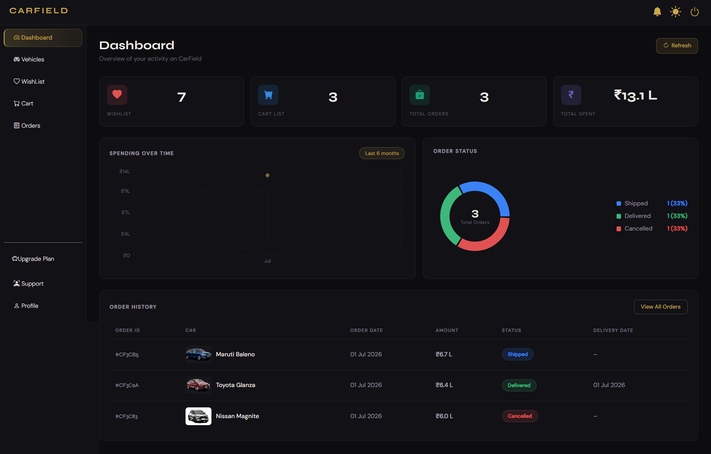 | .png) | .png) |

### 👤 Profile & Support

| Profile | Edit Profile | Support Chat |
|---|---|---|
| 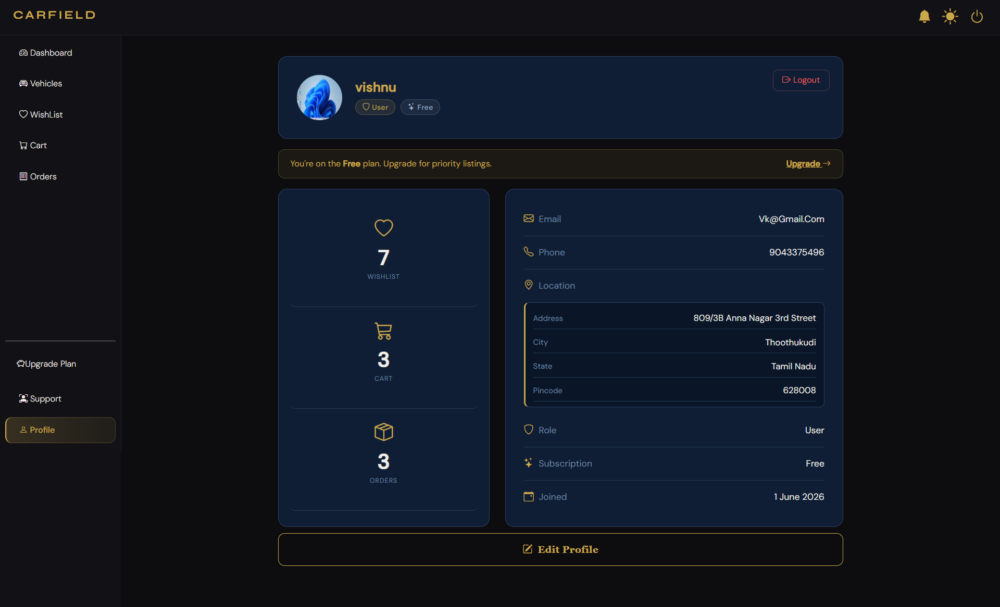 | 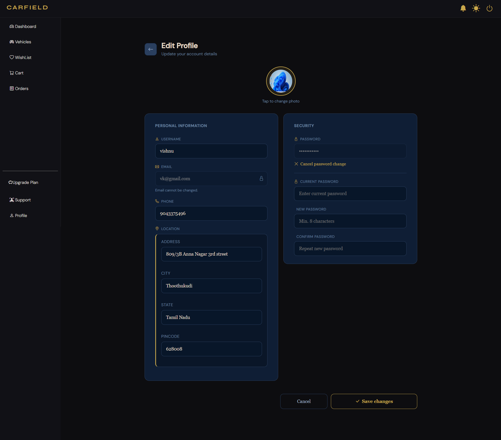 | 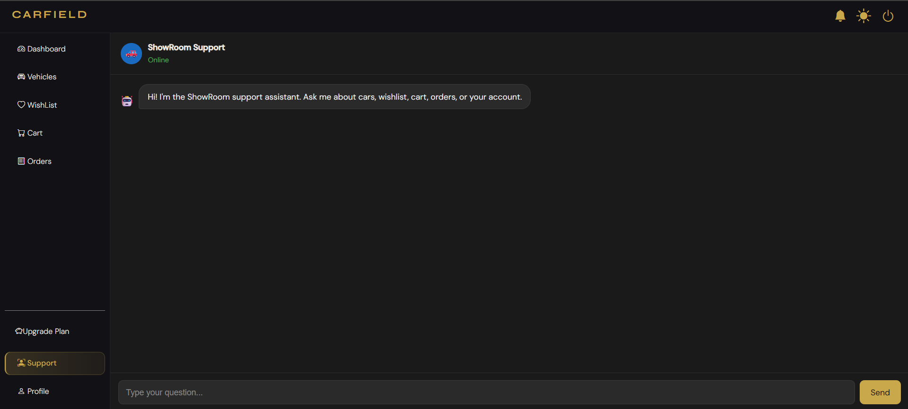 |

---

## 🧩 Tech Stack

**Frontend**
- React (Vite) with React Router (`createBrowserRouter`, lazy-loaded routes with `Suspense`)
- Context API for cart, wishlist, and auth state
- Custom CSS with CSS variables for theming (dark navy/gold default, Clean White & Slate light mode)

**Backend**
- Node.js + Express.js REST API
- MongoDB with Mongoose (embedded document patterns for notifications)
- Socket.IO for real-time, JWT-authenticated, per-user notification rooms

**Auth & Storage**
- JWT-based authentication with Google OAuth 2.0
- Cloudinary for profile photo and image uploads (stream-based buffer upload)

**Deployment**
- Frontend hosted on **Vercel**
- Backend hosted on **Render**
- Cross-domain authentication handled via token-in-URL strategy with `localStorage` fallback (see [Technical Highlights](#-technical-highlights))

---

## 🔍 Technical Highlights

A few real-world engineering problems solved during development:

- **Cross-domain cookie authentication**: Since the frontend (Vercel) and backend (Render) are on different domains, third-party cookies were unreliable across browsers. Solved by issuing the JWT as a URL query parameter (`?token=`) on login/OAuth callback, reading and persisting it client-side in `authProvider.jsx`, and having the backend accept tokens via both cookies **and** the `Authorization` header.
- **Real-time notifications**: Built with Socket.IO using JWT-authenticated, per-user rooms and a one-document-per-user embedded array schema in MongoDB — avoiding a separate notifications collection per event.
- **Google OAuth flow**: Custom callback redirect (`${clientUrl}/?token=${token}`) integrated cleanly into the existing JWT auth system without a separate auth path.
- **Role-based unified dashboard**: A single `Dashboard.jsx` renders entirely different admin/user experiences based on JWT role claims, avoiding duplicated routing logic.
- **Server-side filtering & pagination**: Vehicle queries are filtered, sorted, and paginated at the MongoDB level (not client-side), with debounced search for performance.

---

## 🚀 Getting Started

### Prerequisites
- Node.js (v18+ recommended)
- MongoDB (local instance or MongoDB Atlas)
- A Cloudinary account (for image uploads)
- A Google Cloud OAuth Client ID/Secret (for Google Sign-In)

### Installation

1. **Clone the repository**
   ```bash
   git clone https://github.com/Vishnukumar17072007/car-showroom-project.git
   cd car-showroom-project
   ```

2. **Install backend dependencies**
   ```bash
   cd backend
   npm install
   ```

3. **Install frontend dependencies**
   ```bash
   cd ../frontend
   npm install
   ```

4. **Set up environment variables**

   Create a `.env` file inside the `backend` folder:
   ```env
   PORT=5000
   MONGO_URI=your_mongodb_connection_string
   JWT_SECRET=your_jwt_secret
   CLOUDINARY_CLOUD_NAME=your_cloud_name
   CLOUDINARY_API_KEY=your_api_key
   CLOUDINARY_API_SECRET=your_api_secret
   GOOGLE_CLIENT_ID=your_google_client_id
   GOOGLE_CLIENT_SECRET=your_google_client_secret
   CLIENT_URL=http://localhost:5173
   ```

   Create a `.env` file inside the `frontend` folder:
   ```env
   VITE_API_URL=http://localhost:5000
   ```

5. **Run the backend**
   ```bash
   cd backend
   npm run dev
   ```

6. **Run the frontend**
   ```bash
   cd frontend
   npm run dev
   ```

7. Open [http://localhost:5173](http://localhost:5173) in your browser 🎉

---

## 📁 Folder Structure

```
car-showroom-project/
├── backend/
│   ├── controllers/
│   ├── models/
│   ├── routes/
│   ├── middleware/
│   ├── config/
│   └── server.js
├── frontend/
│   ├── src/
│   │   ├── components/
│   │   ├── pages/
│   │   ├── context/
│   │   ├── hooks/
│   │   └── App.jsx
│   └── vite.config.js
├── screenshots/
├── LICENSE
└── README.md
```

---

## 🗺️ Roadmap

- [ ] Payment gateway integration
- [ ] Car comparison feature
- [ ] EMI calculator
- [ ] Test-drive booking system
- [ ] Multi-language support

Have a feature suggestion? Feel free to [open an issue](https://github.com/Vishnukumar17072007/car-showroom-project/issues).

---

## 📄 License

This project is licensed under the **MIT License** — see the [LICENSE](./LICENSE) file for details.

---

## 👤 Author

**Vishnu Kumar G**

- 📧 Email: [vk2579789@gmail.com](mailto:vk2579789@gmail.com)
- 💼 LinkedIn: [linkedin.com/in/vishnu-kumar-398498371](https://www.linkedin.com/in/vishnu-kumar-398498371)
- 🐙 GitHub: [@Vishnukumar17072007](https://github.com/Vishnukumar17072007)

---

<div align="center">

If you found this project interesting, consider giving it a ⭐ on GitHub!

</div>